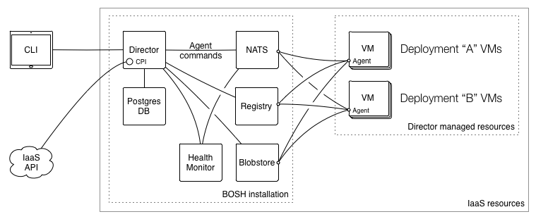

class: center, middle, inverse

# Bosh
# Architecture

---

# BOSH: A distributed system



---

# Components: Blobstore

- Internal storage solution for BOSH
- Sources, releases (jobs, packages, tgz with release)
- Saves the performed uploads from the director
- Works as an intermediary between the director and the agent for all jobs, packages, and sources
- Storing other large BOSH payloads, such as log files and output from the BOSH Agent that exceeds the max size for messages over the *message bus*

---

# Components: Blobstore

There are currently three Blobstores supported by BOSH:

- nginx
- s3
- Atmos
- Swift

???

http://www.emc.com/storage/atmos/atmos.htm

---

# Components: Director

- Provides core orchestrating component in bosh
- Controls VM creation and deployments
- Manages lifecycle events on the deployment

---

# Components: Director

It creates actionable tasks to:
- Translate commands sent by the operator(Bosh CLI)
- scheduled processes such as backups ands snapshots
- reconcile expected state vs the actual state of a VM if needed

---

# Components: Task Queue (Redis)

- Asynchronous queue used by the Director and Workers to manage tasks

---

# Components: Director workers

Take tasks from the Task Queue and acts on them.

---

# Components: Message Bus (NATS)

Pub-sub messaging service system.
Helps to:
- provision instructions to VMs
- Monitor Health of VMs

---

# Components: Health Monitor

- Uses status and lifecycle events received from Agents to monitor the health of VMs
- It can send an alert through notification plugins, or trigger the Resurrector when if finds problems

---
# Components: Registry

- Stores VM configuration Information on bootstraping process of VM
- Its involved during creation and update processes of VMs
- Helps with bootstrapping process of the VMs

---
# Components: DNS Name Server (Powerdns)

 DNS resolution between the VMs in a deployment

---
# Bosh forms and flavors

- Microbosh
- Microbosh + BOSH
- Binary BOSH

---
# Bosh weaknesses
# PowerDNS

* Not just a SPOF for ops activities ... all traffic goes through PowerDNS

* In BOSH it is backed up by a single postgres db

* if Postgres is down then NO DNS requests are serviced and much of your deployments will fail.

???
PowerDNS managed by BOSH for statically referencing jobs within deployment manifests.

---
# Bosh weaknesses
# PowerDNS

Conlusion:
- PowerDNS is ok for development/non-critical production

Alternative Approach:
- Using floating IP's to define statically what IPs will be assigned to each VM

???
alternatives

* In that case you won't need PowerDNS nor OpenStack Neutron

---
# Bosh: Deployment sequence


???

1 Operator takes an action (e.g. deploy for the first time, scaling up deployment) which requires creating a new VM.
2 CLI passes the instruction to the Director.
3 Director uses the CPI to tell the IaaS to launch a VM.
4 IaaS provides the Director with information (IP addresses and IDs) the Agent on the VM needs to configure the VM.
5 Director updates the Registry with the configuration information for the VM.
6 Agent running on the VM requests the configuration information for the VM from the Registry.
7 Registry responds with the IP addresses and IDs.
8 Agent uses the IP addresses and IDs to configure the VM.

---
# Bosh CPI 

- API that the Director uses to interact with an IaaS

--
- Create and manage stemcells, VMs, and disks

--
- Abstracts the cloud infrastructure from the rest of BOSH

---
# 
## CPI Limitations

The Director does not enforce how many networks can be assigned to each job instance

Each CPI might impose custom requirements either due to:
* IaaS limitations 
* feature not yet implemented

|                | static                    | dynamic                 | vip                                  |
|----------------|---------------------------|-------------------------|--------------------------------------|
| AWS            | Single per job instance   | Single per job instance | Single, corresponds to an elastic IP |
| OpenStack      | Multiple per job instance | Single per job instance | Single, corresponds to a floating IP |
| vSphere/vCloud | Multiple per job instance | Not supported           | Not supported                        |                                      |

---

# vSphere CPI: manifest
## Resource pool section
inside `cloud_properties` section:

* **cpu** [Integer, required]: Number of CPUs. Example: `1`.
* **ram** [Integer, required]: RAM in megabytes. Example: `1024`.
* **disk** [Integer, required]: Ephemeral disk size in megabytes. Example: `10240`

* **datacenters** [Array, optional]: Array of datacenters to use for VM placement. Must have only one and it must match datacenter configured in global CPI options.
    * **name** [String, required]: Datacenter name.
    * **clusters** [Array, required]: Array of clusters to use for VM placement.
        * **\<cluster name\>** [String, required]: Cluster name.
            * **drs_rulers** [Array, optional]: Array of DRS rules applied to [constrain VM placement](vm-anti-affinity.html#vsphere). Must have only one.
                * **name** [String, required]: Name of a DRS rule that the Director will create.
                * **type** [String, required]: Type of a DRS rule. Currently only `separate_vms` is supported.

---

# vSphere CPI: manifest
## Resource pool section
### Example of a VM with 1 CPU, 1GB RAM, and 10GB ephemeral disk:

```yaml
resource_pools:
- name: default
  network: default
  stemcell:
    name: bosh-vsphere-esxi-ubuntu-trusty-go_agent
    version: latest
  cloud_properties:
    cpu: 2
    ram: 1024
    disk: 10240
```

---

# vSphere CPI: manifest
## Resource pool section
### Example of a VM asked to be placed on a specific cluster:

```yaml
resource_pools:
- name: default
  network: default
  stemcell:
    name: bosh-vsphere-esxi-ubuntu-trusty-go_agent
    version: latest
  cloud_properties:
    cpu: 2
    ram: 1024
    disk: 10240

    datacenters:
    - name: my-dc
      clusters:
      - my-vsphere-cluster
```

---

# VSphere CPI: manifest 
## Global Configuration section
### Schema:

* **host** [String, required]: IP address of the vCenter. Example: `172.16.68.3`.
* **user** [String, required]: Username for the API access. Example: `root`.
* **password** [String, required]: Password for the API access. Example: `vmware`

* **datacenters** [Array, optional]: Array of datacenters to use for VM placement. Must have only one.
    * **name** [String, required]: Datacenter name.

    * **vm_folder** [String, required]: Path to a folder (relative to the datacenter) for storing created VMs. Folder will be automatically created if not found.
    * **template_folder** [String, required]: Path to a folder (relative to the datacenter) for storing uploaded stemcells. Folder will be automatically created if not found.
    * **disk_path** [String, required]: Path to a *disk* folder for storing persistent disks. Folder will be automatically created in the datastore if not found.

    * **datastore_pattern** [String, required]: Pattern for selecting datastores for storing ephemeral disks and replicated stemcells.
    * **persistent\_datastore\_pattern** [String, required]: Pattern for selecting datastores for storing persistent disks.
    * **allow\_mixed\_datastores** [Boolean, optional]: Flag to indicate if `datastore_pattern` and `persistent_datastore_pattern` can reference same datastores.

    * **clusters** [Array, required]: Array of clusters to use for VM placement.
        * **\<cluster name\>** [String, required]: Cluster name.
            * **resource_pool** [String, optional]: Specific vSphere resource pool to use within the cluster.
???
The CPI can only talk to a single vCenter installation and manage VMs within a single vSphere datacenter.

--- 
# VSphere CPI: manifest 
## Global Configuration section
### Example of a CPI configuration that will place VMs into `BOSH_CL` cluster within `BOSH_DC`:

```yaml
# ...snip...

  host: 172.16.68.3
  user: root
  password: vmware

  datacenters:
  - name: BOSH_DC
    vm_folder: prod-vms
    template_folder: prod-templates
    disk_path: prod-disks

    datastore_pattern: '\Aprod-ds\z'
    persistent_datastore_pattern: '\Aprod-ds\z'
    allow_mixed_datastores: true

    clusters: [BOSH_CL]
```

---

# VSphere CPI: manifest 
## Global Configuration section
### Example that places VMs by default into `BOSH_RP` vSphere resource pool:

```yaml
# ...snip...

  host: 172.16.68.3
  user: root
  password: vmware

  datacenters:
  - name: BOSH_DC
    vm_folder: prod-vms
    template_folder: prod-templates
    disk_path: prod-disks

    datastore_pattern: '\Aprod-ds\z'
    persistent_datastore_pattern: '\Aprod-ds\z'
    allow_mixed_datastores: true

    clusters:
    - BOSH_CL: {resource_pool: BOSH_RP}
```

???
vmware ha
rds
do not clone disk
